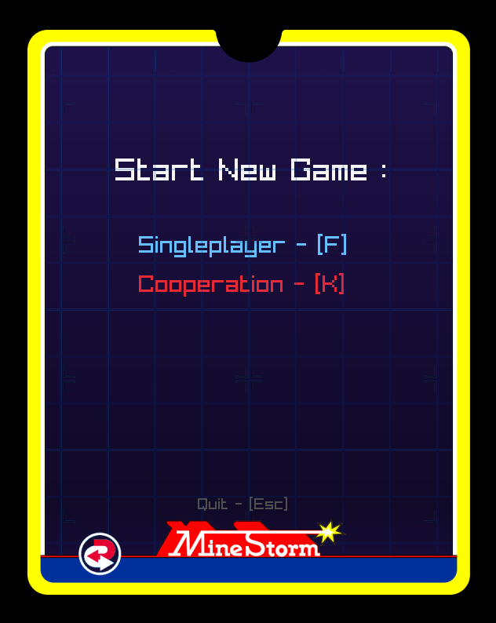
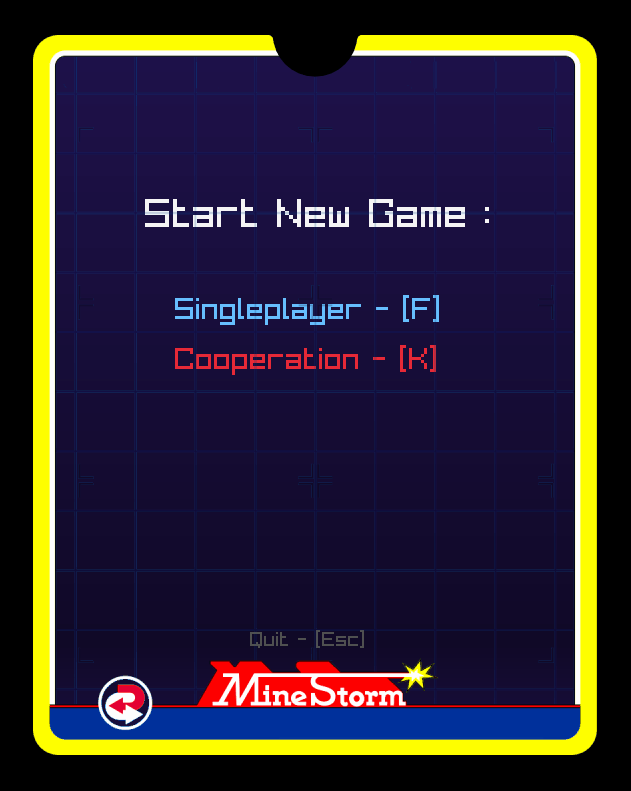
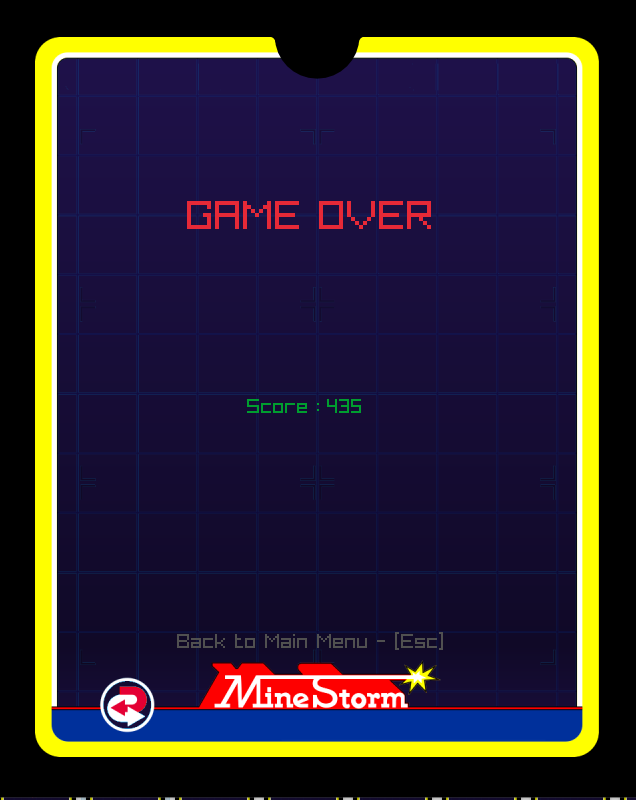

# MINESTORM

>_Rayane Tadjer on november 2020_
## What is Minestorm ?

Minestorm is a Shoot 'Em Up where your goal is to survive and destroy the most amount of mines in a space minefield.

### Summary
 - Compile Game
 - Launch Game
 - Controls
 - Gameplay
 - Mathematics
 - Screenshots

## Compile Game
---
1. **Open game.sln in visual studio**
2. **Choose for debug or release version**
3. **Generate the solution**
4. **Done !**

## Launch Game
---
> execute run_debug.bat  
> or  
> execute run.bat

## Controls
---
### **Global Input**
| Key  | Action                  | 
| ---- | ----------------------- | 
|F     | Start singleplayer game | 
|K     | Start cooperative  game | 
|SPACE | Pause/Unpause game      | 
|C     | Toggle debug view       |  
    
---
### **Player 1 Input**
| Key  | Action                  |   
| ---- | ----------------------- | 
|R     | Move Forward            | 
|F     | Shoot                   | 
|D     | Turn left               | 
|G     | Turn right              |
|E & T | Teleport to random position                         | 

---
### **Player 2 Input**
| Key  | Action                  |   
| ---- | ----------------------- | 
|I     | Move Forward            | 
|K     | Shoot                   | 
|J     | Turn left               | 
|L     | Turn right              |
|U & O | Teleport to random position                         |

## Gameplay
---
### **Core**
- Goal is to win the most highest score by destroying mines
- Game ends if players loose all their lifes
- Invulnerability is displayed as life displayers blinking

### **Life Principle**
- Each player is up to  **3** lifes at the begining
- Friendly fire is **ACTIVATED**
- Hit **ANY** entity or projectile result to loose 1 life
- loosing 1 life gives you 2 seconds of invulnerability that is disabled when shooting

### **Wave Principle**
- Each wave counts 7 mines Spawnpoints x wave number
- When a mine is destroyed, two smaller mines
spawn.
- If all spawnpoints are down and there is no more mines, a new wave starts.
- If all spawnpoints are down but there is still enemies , a Minelayer spawns and replace Spawnpoints 
- Each player got 2 seconds of invulnerability at the begining of a new wave

## Mathematics
---
_Math_toolbox Path_
> include/math_toolbox.h  
>
> src/math_toolbox.cpp
>
_Drift + Newton Path_
> include/player.h at line 29
>
> src/player.cpp at line 78 
>
_Collisions Path_
>
> include/collisions.h
>
> src/collisions.cpp  

_Other methods Path_
>
> include/math_toolbox.h
>
> src/math_toolbox.cpp

## Screenshots
---
_Main Menu_  
  

_Game Starting_  
  

_Game Demo_
  

_Game Over_  
  

